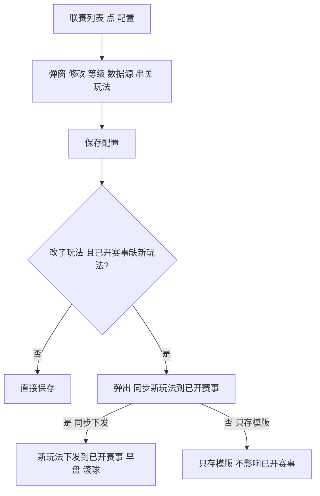

# 联赛管理

**模块**：联赛管理　|　**版本**：v1.0　|　**日期**：2026-06-04　|　**状态**：初稿　|　**依据**：原型 league-management.html + 已确认口径

---

## 版本记录

| 版本 | 日期 | 修改人 | 变更说明 |
|------|------|--------|----------|
| v1.0 | 2026-06-04 | 手册 | 初稿。依据原型重写；移除「主力线」「操盘手分配」；串关改为一般 / 复式；玩法补 BT208 + #22「同步到已开赛事」；生效规则按已确认口径。 |

---

## 一、模块概述

联赛管理是操盘系统的**配置中心**，按「联赛」为单位设置操盘参数；这里改的配置，影响该联赛下面赛事的行为（限额取哪一档、盘口跟不跟数据源、开放哪些串关与玩法）。一期运动范围为**足球**。

- 页面 = 「联赛列表」+「配置弹窗（等级配置 / 数据源配置 / 串关配置 / 玩法启用列表）」。
- **一句话生效规则**：只有「跟随数据源」改了**立即**影响已上架；「玩法启用」保存时**可选**同步到已开赛事；其余（等级 / 串关 / 禁用）只对新上架生效。
- 每个功能按四点写：**① 功能　② 逻辑定义（含查询范围）　③ 操作后体现　④ 是否需立即同步更新**。

---

## 二、名词定义

| 术语 | 含义 |
|------|------|
| 联赛等级 | 等级 1（顶级联赛）~ 等级 10（低级联赛）；未指定的标记为「未分配」 |
| 未分配 | 尚未指定等级的联赛，走「未分配」对应的风控 / 限额 |
| 跟随数据源 | 盘口是否跟随 IM 数据源的开盘 / 暂停状态 |
| 已上架 / 已开赛事 | 已下发、对外开放投注的赛事 |
| 待上架 / 新上架 | 尚未下发的赛事 |
| 早盘 / 滚球 | 赛前盘 / 比赛进行中的滚球盘，两个阶段 |
| BT 编号 | 玩法的统一编号（如 BT208） |

---

## 三、配置保存与同步流程

---

## 四、功能说明

### 4.1 联赛列表
- **① 功能**：表格展示联赛，进入单个联赛的配置。列表列：`联赛ID`、`联赛`、`运动`、`等级`、`跟随数据源`、`串关支持`、`玩法启用`、`操作（配置）`；支持分页。
- **② 逻辑定义（查询范围）**：搜索按联赛名；筛选按运动类型、联赛等级、状态（开启 / 暂停 / 关盘）。范围覆盖全部联赛。
- **③ 操作后体现**：行内点「配置」→ 打开该联赛配置弹窗；搜索 / 筛选后列表即时收敛。
- **④ 是否需立即同步更新**：列表为读取展示，本身不产生变更。

### 4.2 等级配置（联赛等级）
- **① 功能**：为每个联赛配置具体等级，由人员手动指定（等级 1 ~ 10）；未指定标记为「未分配」。等级划分见下表。
- **② 逻辑定义**：等级越高（越接近等级 1 顶级联赛），**风控与限额越严格**；与风控管理「联赛限额」的等级一一对应，具体限额在风控管理配置。
- **③ 操作后体现**：列表「等级」列更新；未指定的显示「未分配」。
- **④ 是否需立即同步更新**：已上架赛事不生效（保持原等级）；未上架 / 新上架按新等级生效。

| 等级 | 定位 | 示例联赛 |
|------|------|----------|
| 等级 1 | 顶级联赛 | 英超、西甲、德甲、意甲、法甲 |
| 等级 2 ~ 9 | 由高到低逐级 | 由人员按实际配置 |
| 等级 10 | 低级 / 冷门联赛 | 由人员按实际配置 |
| 未分配 | 尚未指定等级 | 走「未分配」对应的风控 / 限额 |

### 4.3 数据源配置（跟随数据源盘口状态）
- **① 功能**：设置盘口是否跟随 IM 数据源的开盘 / 暂停状态。默认「是」。
- **② 逻辑定义**：开启后盘口自动跟随数据源；数据源暂停时本地状态不变，仅 C 端显示「暂停投注」。关闭则人工控制。
- **③ 操作后体现**：列表「跟随数据源」列更新。
- **④ 是否需立即同步更新**：**变更后立即生效**——已上架赛事盘口状态立即与数据源同步。

### 4.4 串关配置
- **① 功能**：控制本联赛各串关类型的启用 / 停用；列表「串关支持」为该联赛串关总开关。
- **② 逻辑定义**：
  - **一般串关**：2串1 ~ 10串1，逐类型可启 / 停；各类型「单注限额 / 总货量上限」为只读，仅风控管理可编辑。
  - **复式串关**：3串4、3串7、4串11、4串15、5串26、5串31、6串57、6串63 等；单注金额跟随其所含最高的 N串1，总投入 = 单注 × 组合数；限额在风控管理配置。
- **③ 操作后体现**：列表「串关支持」更新；各串关类型启停随之变化。
- **④ 是否需立即同步更新**：仅新上架赛事生效，已上架不变。

### 4.5 玩法启用列表（足球）
- **① 功能**：按联赛启用 / 停用玩法。支持「全部启用 / 全部禁用 / 反选」，并可按 BT 编号筛选（全部 / BT1-50 / BT51-100 / BT101-200 / BT200+ / 其他）。
- **② 逻辑定义**：足球共 208 种玩法（BT 编号，如 BT208），按 6 组管理——让球、大小、角球、进球、半场、特殊；分组定义以风控管理第四章为准。顶部显示「已启用 X / Y 个玩法」。
- **③ 操作后体现**：「已启用 X / Y」计数更新；该联赛赛事开放的玩法随之变化。
- **④ 是否需立即同步更新**：**保存时按需同步（#22）**——保存时若检测到已开赛事缺本次新增玩法，弹出「⚠️ 同步新玩法到已开赛事」：
  - 「是，同步下发」：新玩法下发到这些已开赛事（早盘 / 滚球）；
  - 「否，只存模版」：仅存模版，不影响已开赛事；
  - 无缺失则直接保存。

---

## 五、字段说明（联赛配置弹窗）

| 字段 | 类型 | 必填 | 默认值 | 边界 / 说明 |
|------|------|------|--------|------------|
| 联赛等级 | 下拉 | 是 | 未分配 | 等级 1~10 + 未分配；等级越高，风控 / 限额越严格 |
| 跟随数据源盘口状态 | 开关 | 是 | 是 | 开 = 跟随 IM；变更后立即生效 |
| 串关支持 | 开关 | 是 | — | 该联赛串关总开关；细项在一般 / 复式 |
| 一般串关（2串1~10串1） | 启停 | — | — | 逐类型启停；限额只读，风控管理编辑 |
| 复式串关（3串4…6串63） | 启停 | — | — | 单注跟随其所含最高 N串1 |
| 玩法启用 | 多选 | 是 | 全部启用 | 208 种（BT 编号），6 组管理 |

---

## 六、配置生效规则总表（哪些需立即同步更新）

| 配置变更 | 对已上架 / 已开赛事 | 对待上架 / 新上架 |
|----------|--------------------|------------------|
| 联赛禁用 | 不受影响 | 从待上架列表移除 |
| 联赛等级变更 | 不生效（保持原等级） | 按新等级 |
| **跟随数据源变更** | **立即生效**，盘口状态立即与数据源同步 | 按新配置 |
| 串关启停变更 | 不变 | 仅新上架生效 |
| **玩法启用变更** | **保存时可选同步**（#22：同步下发 / 只存模版） | 按新配置 |

> 记忆点：只有「跟随数据源」改了会立即影响已上架；「玩法启用」保存时可选是否同步到已开赛事；其余（等级 / 串关 / 禁用）只对新上架生效。

---

## 七、与其他模块的关系

| 联赛管理配置 | 关系 |
|--------------|------|
| 联赛等级 | ↔ 风控管理「联赛限额」的等级（每档对应单场限额 + 玩法分组限额） |
| 串关 / 玩法限额 | 只读取自风控管理（本页只控启停，限额在风控管理编辑） |
| 玩法启用（6 组） | ↔ 风控管理「玩法限额」的 6 组结构 |
| 跟随数据源 = 是 | 上架后盘口自动跟随数据源开盘 / 暂停 |
| 联赛禁用 | 该联赛赛事不出现在操盘列表的待上架列表 |
| 操盘手分配 | 不在本模块，唯一入口在操盘列表 |

---

## 八、验收要点

| 编号 | 验证内容 | 预期结果 |
|------|----------|----------|
| 1 | 在联赛列表按联赛名称搜索 | 列表只显示名称匹配的联赛 |
| 2 | 按运动类型 / 联赛等级 / 状态（开启·暂停·关盘）筛选 | 列表按所选条件收敛，且覆盖全部联赛（含已禁用） |
| 3 | 进入某联赛配置，修改联赛等级并保存 | 已上架赛事保持原等级限额不变；之后新上架赛事按新等级取限额 |
| 4 | 修改「跟随数据源盘口状态」并保存 | 已上架赛事盘口状态立即与数据源同步（立即生效） |
| 5 | 修改玩法启用并保存，存在缺本次新增玩法的已开赛事，弹框选「是，同步下发」 | 新增玩法下发到这些已开赛事（早盘 / 滚球），提示已下发 N 场 |
| 6 | 同样存在缺玩法的已开赛事，弹框选「否，只存模版」 | 仅保存模版，已开赛事不变，提示已保存模版、未同步 |
| 7 | 修改玩法启用并保存，但无已开赛事缺玩法 | 不弹同步框，直接保存成功 |
| 8 | 禁用某联赛 | 该联赛从操盘列表的待上架列表移除；已上架赛事不受影响 |
| 9 | 修改串关类型（一般 / 复式）启停并保存 | 仅对新上架赛事生效，已上架赛事不变 |